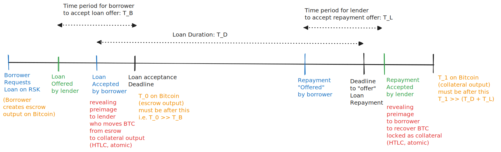
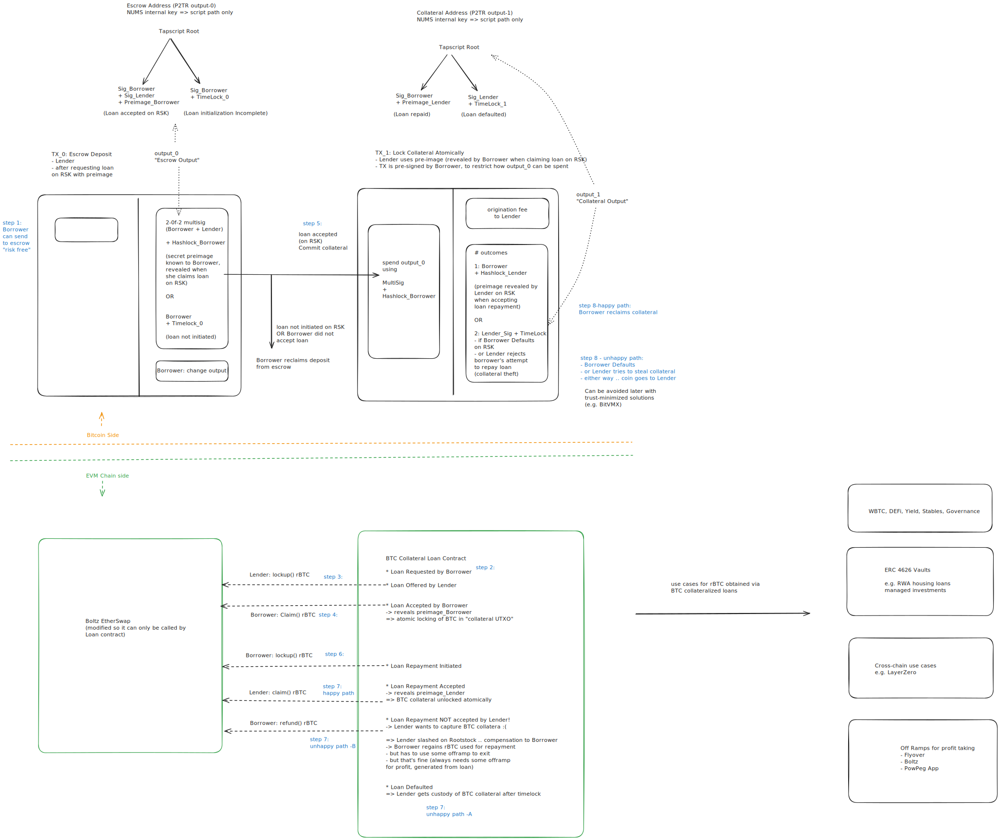

# BTC-collateralized loans on EVM chains (and maybe a vault)

Note: See the [architecture](./ARCHITECTURE.md) as well, which has a step by step quickstart for local testing / demo.

This is a poc to implement a pathway for bitcoin holders to earn yield from an
EVM chain without giving up complete control of BTC. The  BTC will remain 
locked as collateral in joint custody with the lender on the EVM chain.

Loan initiation is atomic, using HTLC (e.g. www.Boltz.exchange). While this is not
a swap, the process is still trustless. Loan repayment (and collateral release) is 
also atomic, but not trustless. This is because the lender cannot be forced to accept
repayment. In this case the lender can be slashed by the borrower. If the lender does
accept the repayment, then the BTC is relased atomically using HTLC logic. Once BitVMX is
available as an "off-the-shelf" solution, we can use that as a trust-minimized solution for borrowers. 

Target EVM chain is Rootstock: The contracts use Ether, but when used on Rootstock, the native
currency is BTC (rBTC). When used on other chains, wrapped version of bitcoin (WBTC) can be used instead
of Ether - to avoid using an Oracle service for BTC:ETH price volatility. 
In that case, the erc20Swap HTLC contract  (from Boltz.exchange) should be used instead of etherswap.

## Repo Structure

Overall Layout: 
* Solidity contracts for loans on EVM chain loans in rBTC the native coin on rootstock
* Tapscript based bitcoin "contracts" (HTLC + mutlsig + timelocks) to joint custody of colleteral 
    * atomic locking of BTC collateral on loan activation (on EVM chain)
    * atomic release of BTC collateral on loan repayment acceptance (on EVM chain)
* centralized services 
    * wagmi based DApp front-end
        * anvil chain for EVM node
    * which talks to express backend
        * python-api for Bitcoin services -> connected to Bitcoin Core RPC
        * postgres DB for loan lifecycle

### Loan Dapp
The core solidity contracts are in `evmchain` which uses Foundry. The main loan contract uses
etherswap from Boltz.exchange with HTLC functionality to link loan activation and repayment 
 with atomic locking and unlocking of collateral on bitcoin (bitcon side is abstracted in 
 initial version).

The front end wagmi application to manage the EVM side of 
loans is in `evm-dapp`

### EVM
The project uses Anvil for a local ethereum blockchain

### Bitcoin core backend (docker)

The tests use a bitcoin core backend running in "regtest". There is a docker file for this purpose
in the directory `btc-backend`.

Start the container `docker compose up -d` before running the tests.

### Python package for bitcoin side of things

The dir `btc-vaultero` has a python package `vaultero` to implement the bitcoin side of the 
logic for the bitcoin-colleteralized loan. The vaultero package uses `bitcoinutils`. 

See the package [readme](btc-vaultero/README.md) for more info on setup and testing within a venv.

Requires btc-backend for tests.

### backend-service
For orchestration and loan management. This is a node express stack. 

### python-api
The bitcoin address, script generation and transaction services API based on the vaultero package and served using uvicorn.
The express backend service communicates with this python-api.

A borrower will run their own local version of this API to verify addresses, scripts, and to pre-sign collateral transactions.

Requires btc-backend for tests.

### Config: Parameters
`Config` directory contains some parameters such as timelocks, fees. This has python scripts (and a Makefile) to make it easier to use and update the parameters used by codebase in python, typescript, solidity.
 

### Misc repos for background project prep
The directory `py-bitcoin-scripts` contains some examples from the original bitcoin utils repo.  They have been extended to suit our needs. As with the package tests, start the bitcoin container before running the scripts. This repo was a way to gain familiarity with creating Taproot contracts /utxos.

Similarly, the code in the directory `rust-bitcoin-scripts` contains early attempts to use miniscript for the PoC. These are still very elementary.

## Notes on Business logic

### Timelocks

There are several time periods we care about
* $t_{D}$: loan duration. 
    * Borrower must repay loan on EVM chain before this. Otherwise, the lender can mark the loan as defaulted.
* $t_{B}$: time period for borrower to accept lender's offer
    * On Rootstock. Lender `lock`s loan amount in EtherSwap contract
    * Borrower does this via `claim`-ing the amount locked in EtherSwap
    * If not accepted, lender can recover the amount locked in EtherSwap (via `refund`) 
* $t_{L}$: time period for lender to accept the borrower's repayment
    * On Rootstock. Borrower `lock`s loan amount in EtherSwap
    * Lender accepts repayment via `claim`-ing the amount locked in EtherSwap
    * If not accepted, borrower can recover the amount locked in EtherSwap (via `refund`)

There are also two durations on Bitcoin. These are implemented as relative timelocks on bitcoin.
* $t_{0}$: escrow timelock
    * Borrower can spend escrow output after this.
    * This means the loan was either not extended, or the borrower did not accept the offer.
    * This is not the expected path - it is just for borrower's safety. 
    * The expected path is for the borrower to accept the loan on EVM chain, revealing a preimage. 
    The lender can use perimage to spend the escrow utxo to create the the collateral utxo (with borrower's pre-sig)  
* $t_{1}$: collateral timelock
    * Lender can spend collateral output after this.
    * This happens when the borrower defaults on the loan. Or the lender does not accept the borrower's loan repayment.
    * As with $t_{0}$ above, this is not the expected path.
    * The expected path is for borrower to repay on EVM chain and the lender to accept it, revealing a preimage. The
    borrower can then use the preimage to regain their collateralized BTC.

Thus, $t_{0}$ and $t_{1}$ are both "backup" mechanisms for unexpected situations. They should both be set conservatively (larger for more safety).
$t_{0}$ can be set very conservatively, to be much longer than the corresponding relative duration on EVM chain, which is $t_{B}$.  
$t_{1}$ can be set conservatively to be larger than the overall duration of the loan $t_{D}$ and also allowing additional time for the lender to accept the borrower's repayment.

* On Bitcoin: The clock for $t_{0}$ starts when the borrower creates the escrow utxo. The lender will not offer a loan before the escrow contract (utxo) is funded.
* On EVM chain: The clock for $t_{B}$ starts when the lender offers the loan. Borrower should accept before $t_{B}$ blocks.
* To keep things simple, the borrower should deposit BTC into escrow only after the loan has been offerred. If they create the escrow output first, 
    then they should use a $t_{0}$ that is very large to allow the lender enough time to offer a loan with $t_{B}$ still less than the remaining time on bitcoin.

The implementation uses number of blocks instead of time. Therefore, users should validate that the implementation accounts for the 
different rates of block production across Bitcoin and EVM chain (e.g. 1:20 for Rootstock and Bitcoin). Any production scenario would need to 
account for differences in number of "confirmations". 

## How to run locally

See [architecture.md](./ARCHITECTURE.md)