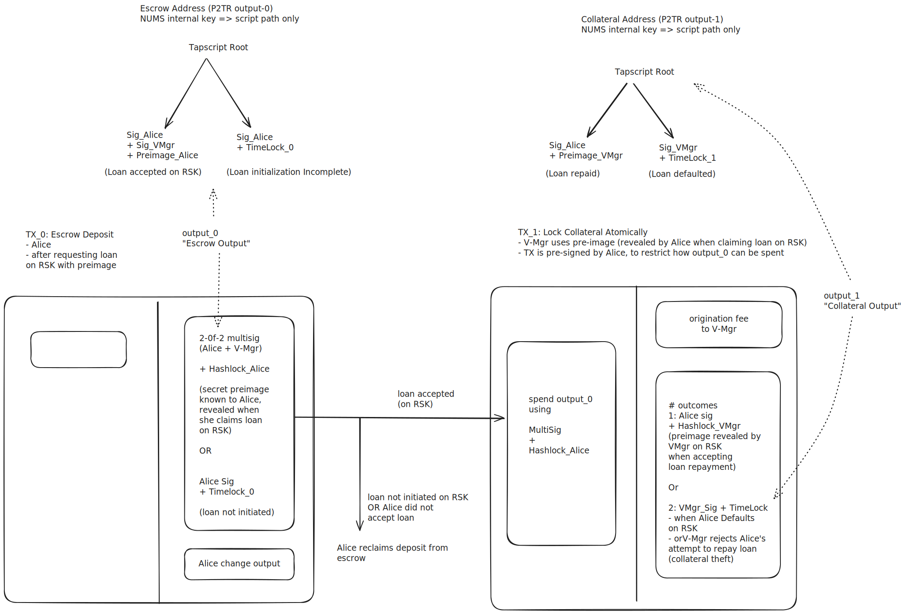

# vaultero

A simple package to create btc transactions for use in a btc2evm vault application where
bitcoins are used as collateral for loans on an evm chain.

To avoid the use of oracle services on bitcoin (e.g. DLC etc), it is assumed that the loan on the 
EVM chain will be in BTC equivalent asssets e.g. rBTC on Rootstock, or wrapped BTC ERC20 tokens. 
All EVM chains have BTC equivalents, e.g. cbBTC on Base. Oracles, if required can be purely on the 
EVM side. 

The idea is that a borrower puts bitcoin into an escrow output. This coin can be moved 
by the lender to a collateral utxo, but only if the borrower has accepted the lender's offer 
for a loan on the evm chain. This atomic locking is done in the usual way using HTLCs.  If the
repayment is accepted by the lender, then the collateral is atomically released to the borrower
(again using HTLC logic). If the borrower defaults on the loan (EVM chain), then the lender 
can spend the collateral output after a timelock. To restrict the spending of the escrow output, 
the parties make use of pre-signed transactions, to ensure that coins can only be spent in
a restricted sequence of transactions. This is what the package is meant to facilitate.

IMPORTANT: this package uses (bitcoinutils)[https://github.com/karask/python-bitcoin-utils]. 
The release available on pypi is outdated. Hence a specific commit from the main repo is used.
For example, the release version does not incluce `op_CheckSigAdd`. This is also why some of the 
latest examples do not work with the relased version. Therefore, users should decide
whether to use a different commit or release in `pyproject.toml`   


## Transaction Graph
There are two main transactions to be set up: these are illustrated in this [simple diagram](./images/tx_graph_img.svg):




1. `TX_0` sets up an escrow. Alice sends bitcoin to a P2TR address `output_0` - the "escrow output".
* this can spent via a 2-of-2 multisig + a preimage. The pre-image is revealed on RSK when Alice accepts VMgr's offer of a loan.
* if VMgr does not offer the loan within some time, or if Alice changes her mind and does not take the loan, then she can spend the output
after a timelock.
2. `TX_1` Atomically lock funds: This transaction consumes the escrow ouput and creates a P2TR `output_1`- the "collateral output". 
* if Alice accepts the loan offer on RSK, then VMgr can use the revealed preimage to spend the escrow output. Alice pre-signs this transaction, 
and VMgr addes the preimage to the witness stack prior to broadcast.
* Once `TX_1` is confirmed, the loan is fully backed by the collateral

The spending of the collateral output depends on how the loan is resolved on RSK (i.e. default, repayment). On default, the collateral 
can be spent by lender after a timelock. On successful repayment, a HTLC flow ensures the borrower can reclaim their collateral.

## Profit taking and Security

It is assumed that any profit generated from the loan will need to be converted to BTC using some other methods. The current
setup can only release the initial collateral amount to the borrower. It is plausible that the lender can offer to lock some bitcoin
from their end into the collateral contract (output) to allow for additional BTC as profit - however this will still be limited to the value
locked (now jointly) in the collateral contract.

A minimal security assumption is that no party ever reuses their preimages. Apart from that, to prevent lockins or complexities due to


## Quickstart

Clone the repo and create a virtual env. to install the package in dev mode

```bash or zsh
python -m venv . #from the repo dir or select desired name
source bin/activate #from the venv dir 
pip install -U pip #optional
# Edit pyproject.toml to set desired commit SHA
# “Install the package in this folder, in editable mode, along with all dependencies needed for the dev extras group.”
pip install -e '.[dev]' # use quotes or the shell might mistake it for a pattern to search

# Needs bitcoin node to be running for rpc (regtest with credentials for testing)
pytest -v #-q for quiet, -s to stop capture of println, or other e.g. select specific tests
```

The tests demonstrate how to set implement the graph of transactions, including the addition of appropriate witness elements to spent the 
escrow and collateral outputs.


