# BTC Yield Protocol Configuration System

This directory contains the centralized configuration system for the BTC Yield Protocol. It serves as a single source of truth for parameters used across Python code, Solidity contracts, and TypeScript/wagmi applications.

## 📁 Files Overview

| File | Purpose | Usage |
|------|---------|--------|
| `parameters.json` | Master configuration file in JSON format | Source of truth for all parameters |
| `python_config.py` | Python configuration module | Use in Bitcoin scripts and backend |
| `typescript_config.ts` | TypeScript configuration module | Use in React/wagmi frontend |  
| `../evmchain/src/ProtocolConfig.sol` | Auto-generated Solidity configuration | Use in smart contracts |
| `README.md` | Documentation | This file |

## 🏗️ Architecture

```mermaid
graph TD
    A[parameters.json<br/>📝 MASTER CONFIG] --> B[python_config.py<br/>🐍 Runtime Loading]
    A --> C[typescript_config.ts<br/>📘 Runtime Loading] 
    A --> D[generate_solidity_config.py<br/>🔧 Build-time Generation]
    
    D --> E[ProtocolConfig.sol<br/>⚡ Auto-Generated]
    
    B --> F[Bitcoin Scripts]
    B --> G[Backend Services]
    
    C --> H[React Frontend]
    C --> I[wagmi Integration]
    
    E --> J[Smart Contracts]
    E --> K[Deployment Scripts]
    
    L[sync_validation.py<br/>🔍 Validation] --> A
    L --> B
    L --> C
    L --> E
```



## 🔄 Synchronization Architecture

**Important**: Due to blockchain limitations, we use different synchronization strategies:

- **Python & TypeScript**: Load `parameters.json` dynamically at runtime ✅
- **Solidity**: Uses auto-generated constants (cannot read JSON files) ⚡

**Solution**: Build-time code generation ensures all systems stay in sync!

## 🔧 Configuration Management Workflow

### 1. **Update Configuration**
```bash
# Edit the master configuration
vim config/parameters.json
```

### 2. **Regenerate Solidity Configuration**
```bash
# Auto-generate Solidity constants from JSON
python config/generate_solidity_config.py

# Or use the Makefile
make generate
```

### 3. **Validate Synchronization**
```bash
# Check all systems are in sync
python config/sync_validation.py

# Auto-fix any issues
python config/sync_validation.py --auto-fix

# Or use the Makefile
make validate
make sync  # auto-fix
```

### 4. **Run Tests**
```bash
# Test all configurations
make test

# Test individual systems
make test-python
make test-ts
make test-solidity
```

## 🛠️ Management Tools

| Tool | Purpose | Usage |
|------|---------|-------|
| `generate_solidity_config.py` | Generate Solidity from JSON | `python generate_solidity_config.py` |
| `sync_validation.py` | Validate synchronization | `python sync_validation.py [--auto-fix]` |
| `Makefile` | Automation commands | `make help` |
| Test scripts | Verify functionality | `make test` |

## ⚠️ Important Notes

### **Critical Synchronization Rule**
- ✅ **Always update `parameters.json` first**
- ✅ **Always run `make generate` after editing JSON**
- ✅ **Always run `make validate` before committing**
- ❌ **Never edit `ProtocolConfig.sol` manually**

### **Auto-Generated Files**
The following file is **auto-generated** and should **never be edited manually**:
- `evmchain/src/ProtocolConfig.sol`

This file includes warnings and timestamps indicating it's auto-generated.

### **Git Workflow**
```bash
# 1. Edit configuration
vim config/parameters.json

# 2. Regenerate and validate
make generate
make validate

# 3. Test everything
make test

# 4. Commit all changes (including generated files)
git add config/parameters.json
git add evmchain/src/ProtocolConfig.sol
git commit -m "Update protocol parameters"
```

## 📋 Configuration Categories

### Fees
- **Processing Fee**: 0.001 ether (refundable, spam prevention)
- **Origination Fee**: 1% of loan amount
- **Lender Bond**: 10% of loan amount

### Limits
- **Minimum Loan**: 0.005 ether (~$500)  
- **Maximum Loan**: 100 ether (configurable)

### Timelocks (in blocks)
- **t_B (loanRequest)**: 100 blocks - Loan request acceptance timelock
- **t_0 (btcEscrow)**: 200 blocks - BTC escrow timelock (must be > t_B)
- **t_L (repaymentAccept)**: 150 blocks - Repayment acceptance timelock  
- **t_1 (btcCollateral)**: 250 blocks - BTC collateral release (must be > t_L)
- **t_D (loanDuration)**: 540,000 blocks - Total loan duration (6 months on Rootstock)

### Interest Rates
- **Default**: 8% annual
- **Minimum**: 1% annual
- **Maximum**: 25% annual

### Blockchain Configuration
- **BTC to EVM Block Ratio**: 1:20 (approximate)
- **Bitcoin Confirmations**: 6 required
- **EVM Confirmations**: 12 required

## 🐍 Python Usage

```python
from config.python_config import Config, get_timelock, get_fee

# Load configuration
config = Config()

# Access fee parameters
processing_fee = config.processing_fee.get_decimal_value()
origination_fee_rate = config.origination_fee.get_percentage_decimal()

# Get timelock values
loan_duration_evm = config.get_timelock('loanDuration')  # EVM blocks
loan_duration_btc = config.get_timelock('loanDuration', for_bitcoin=True)  # Bitcoin blocks

# Calculate fees
bond_amount = config.get_fee_amount('lender_bond', loan_amount='1.0')
processing_fee = config.get_fee_amount('processing', loan_amount='1.0')

# Network configuration
mainnet_config = config.get_network_config('mainnet', 'ethereum')
testnet_btc = config.get_network_config('testnet', 'bitcoin')

# Validation
is_valid_pubkey = config.validate_bitcoin_pubkey(pubkey_string)
is_valid_hash = config.validate_preimage_hash(hash_string)

# Convenience functions
timelock_blocks = get_timelock('btcEscrow', for_bitcoin=True)
fee_amount = get_fee('origination', amount=2.5)
```

## 📘 TypeScript Usage

```typescript
import { config, getTimelock, getFee, getNetworkConfig, CONSTANTS } from './config/typescript_config'

// Access configuration values
const processingFee = config.fees.processingFee.value
const minLoanAmount = config.limits.minLoanAmount.value

// Get timelock values
const loanDurationEvm = getTimelock('loanDuration')  // EVM blocks
const loanDurationBtc = getTimelock('loanDuration', true)  // Bitcoin blocks

// Calculate fees
const originationFee = getFee('origination', 1.0)  // 1% of 1.0 ETH
const lenderBond = getFee('lenderBond', 2.5)  // 10% of 2.5 ETH

// Network configuration  
const anvilConfig = getNetworkConfig('development', 'ethereum')
const testnetConfig = getNetworkConfig('testnet', 'ethereum')

// Use constants (compatible with existing code)
const PROCESSING_FEE_WEI = CONSTANTS.PROCESSING_FEE
const MIN_LOAN_WEI = CONSTANTS.MIN_LOAN_AMOUNT

// Legacy compatibility
import { CONTRACT_CONFIG, BTC_PUBKEY_PLACEHOLDER, NETWORK_CONFIG } from './config/typescript_config'
```

## ⚡ Solidity Usage

```solidity
// SPDX-License-Identifier: MIT
pragma solidity ^0.8.30;

import "./config/ProtocolConfig.sol";

contract MyLoanContract {
    using ProtocolConfig for *;
    
    function createLoan(uint256 amount) external payable {
        // Validate loan amount
        require(
            ProtocolConfig.validateLoanAmount(amount),
            "Invalid loan amount"
        );
        
        // Check processing fee
        require(
            msg.value >= ProtocolConfig.getProcessingFee(),
            "Insufficient processing fee"
        );
        
        // Calculate fees
        uint256 originFee = ProtocolConfig.calculateOriginationFee(amount);
        uint256 bondAmount = ProtocolConfig.calculateLenderBond(amount);
        
        // Use timelock values
        uint256 timelock = block.number + ProtocolConfig.getTimelockLoanReq();
        
        // Convert to Bitcoin blocks if needed
        uint256 btcTimelock = ProtocolConfig.evmBlocksToBtcBlocks(
            ProtocolConfig.getTimelockBtcEscrow()
        );
        
        // Calculate interest
        uint256 interest = ProtocolConfig.calculateInterest(
            amount,
            ProtocolConfig.getDefaultInterestRateBps(),
            ProtocolConfig.getLoanDuration(),
            1095000  // Rootstock blocks per year
        );
    }
    
    // Access constants directly
    uint256 public constant MIN_LOAN = ProtocolConfig.MIN_LOAN_AMOUNT;
    uint256 public constant MAX_LOAN = ProtocolConfig.MAX_LOAN_AMOUNT;
}
```

## 🔧 Configuration Management

### Updating Parameters

1. **Modify `parameters.json`**: Update the master configuration file
2. **Test changes**: Ensure all dependent modules can load the new configuration
3. **Deploy updates**: Update contracts and redeploy if necessary

### Adding New Parameters

1. **Add to `parameters.json`**: Include new parameter with proper structure
2. **Update language modules**: Add support in Python, TypeScript, and Solidity
3. **Update documentation**: Document the new parameter and its usage

### Version Management

The configuration system uses semantic versioning:
- **Major**: Breaking changes to parameter structure
- **Minor**: New parameters or non-breaking changes  
- **Patch**: Bug fixes or documentation updates

## 🌐 Network Configurations

### Development (Anvil)
- **Ethereum**: Chain ID 31337, http://127.0.0.1:8545
- **Bitcoin**: Regtest, http://127.0.0.1:18443

### Testnet
- **Ethereum**: Rootstock Testnet (Chain ID 31)
- **Bitcoin**: Testnet

### Mainnet  
- **Ethereum**: Rootstock Mainnet (Chain ID 30)
- **Bitcoin**: Mainnet

## 🔒 Security Considerations

### Parameter Validation
- All modules include validation functions for addresses, hashes, and amounts
- Timelock ordering constraints are enforced
- Interest rate bounds are validated

### Update Safety
- Production systems should use immutable references to avoid config changes during execution
- Critical parameters (like fees) should be updated through governance mechanisms
- Test all changes in development/testnet environments first

### Access Control
- Configuration files should have appropriate file permissions
- Consider using environment variables for sensitive network configurations
- Implement parameter change notifications in production systems

## 🧪 Testing

### Python Tests
```python
import pytest
from config.python_config import Config

def test_config_loading():
    config = Config()
    assert config.version == "1.0.0"
    assert config.processing_fee.get_decimal_value() == Decimal('0.001')

def test_timelock_conversion():
    config = Config()
    evm_blocks = config.get_timelock('loanDuration')
    btc_blocks = config.get_timelock('loanDuration', for_bitcoin=True)
    assert btc_blocks == evm_blocks // 20  # 1:20 ratio
```

### TypeScript Tests
```typescript
import { config, getTimelock, validateBitcoinPubkey } from './typescript_config'

describe('Configuration', () => {
  test('loads configuration correctly', () => {
    expect(config.version).toBe('1.0.0')
    expect(config.fees.processingFee.value).toBe('0.001')
  })
  
  test('calculates timelocks correctly', () => {
    const evmBlocks = getTimelock('loanDuration')
    const btcBlocks = getTimelock('loanDuration', true)
    expect(btcBlocks).toBe(Math.floor(evmBlocks / 20))
  })
})
```

### Solidity Tests
```solidity
contract ProtocolConfigTest {
    function testTimelockOrdering() public {
        assertTrue(ProtocolConfig.validateTimelockOrdering());
    }
    
    function testFeeCalculation() public {
        uint256 loanAmount = 1 ether;
        uint256 fee = ProtocolConfig.calculateOriginationFee(loanAmount);
        assertEq(fee, loanAmount / 1000);  // 0.1% fee
    }
}
```

## 📚 Migration Guide

### From Existing Constants
If you have existing hardcoded constants, here's how to migrate:

**Old TypeScript:**
```typescript
const PROCESSING_FEE = 0.001
const LOAN_DURATION = 3000 * 180
```

**New TypeScript:**
```typescript
import { CONSTANTS, getTimelock } from './config/typescript_config'

const PROCESSING_FEE = CONSTANTS.PROCESSING_FEE
const LOAN_DURATION = CONSTANTS.LOAN_DURATION
// or
const LOAN_DURATION = getTimelock('loanDuration')
```

**Old Solidity:**
```solidity
uint256 public constant PROCESSING_FEE = 0.001 ether;
uint256 public constant LOAN_DURATION = 540000;
```

**New Solidity:**
```solidity
import "./config/ProtocolConfig.sol";

uint256 public constant PROCESSING_FEE = ProtocolConfig.PROCESSING_FEE;
uint256 public constant LOAN_DURATION = ProtocolConfig.LOAN_DURATION;
```

## 🤝 Contributing

When contributing to the configuration system:

1. **Follow naming conventions**: Use camelCase for JSON, snake_case for Python, camelCase for TypeScript, UPPER_CASE for Solidity constants
2. **Add documentation**: Every parameter should have a description
3. **Include validation**: Add validation functions for new parameter types
4. **Test thoroughly**: Ensure changes work across all language modules
5. **Update examples**: Keep usage examples current

## 📞 Support

For questions or issues with the configuration system:
- Check existing parameter documentation in `parameters.json`
- Review usage examples in this README
- Test changes in development environment first
- Consider backward compatibility when making changes
